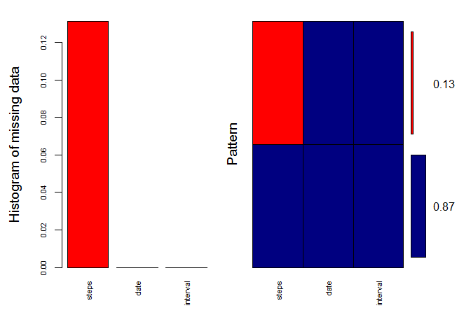

# Reproducible Research: Peer Assessment 1


#####The following will be needed:


```r
  library(dplyr)
  library(mice)
  library(VIM)
  library(ggplot2)
```

#####Data from a personal activity monitoring device. This device collects data at 5 minute intervals through out the day. The data consists of two months of data from an anonymous individual collected during the months of October and November, 2012 and include the number of steps taken in 5 minute intervals each day.  
https://d396qusza40orc.cloudfront.net/repdata%2Fdata%2Factivity.zip

#####Code for reading in the dataset:

```r
fileIn <- read.csv("activity.csv")
```

#####First look at the data with no NAs

```r
noNa <- fileIn[complete.cases(fileIn),]
```

#####Set date and sum of steps

```r
noNa$date <-  as.Date(noNa$date, format = "%Y-%m-%d")
totalStepDay <- aggregate(steps ~ date, noNa, sum)
```

#####Histogram of the total number of steps taken each day:

```r
hist(totalStepDay$steps, xlab = "Steps", col = "navyblue", main = "Histogram of Activity Steps")
```

<!-- -->

#####Mean and median number of steps taken each day

```r
mean(totalStepDay$steps)
```

```
## [1] 10766.19
```

```r
median(totalStepDay$steps)
```

```
## [1] 10765
```

#####Time series plot of the average number of steps taken

```r
intervalStep <- aggregate(steps ~ interval, noNa, mean)
avgStepsTaken <-tapply(noNa$steps,noNa$interval, mean)
plot(avgStepsTaken, type = "l", col = "navyblue", xlab = "Interval Index", ylab = "Steps Taken")
```

<!-- -->

#####The 5-minute interval that, on average, contains the maximum number of steps.  
#####The maximun steps rounded:

```r
maxStepsRound <- round(max(intervalStep$steps))
maxStepsRound
```

```
## [1] 206
```

#####Which Interval:

```r
interval <- which.max(intervalStep$steps)
interval
```

```
## [1] 104
```

#####Number of missing data = 2304

```r
md.pattern(fileIn)
```

```
##       date interval steps     
## 15264    1        1     1    0
##  2304    1        1     0    1
##          0        0  2304 2304
```

#####Histogram and Pattern of missing data, another view showing all NAs are within steps

```r
aggr_plot <- aggr(fileIn, col=c('navyblue','red'), numbers=TRUE, sortVars=TRUE, labels=names(data), cex.axis=.7, gap=3, ylab=c("Histogram of missing data","Pattern"))
```

<!-- -->

```
## 
##  Variables sorted by number of missings: 
##  Variable     Count
##     steps 0.1311475
##      date 0.0000000
##  interval 0.0000000
```

#####Code to describe and show a strategy for imputing missing data. Will show if there much comparable difference.

```r
fileIn$steps <- as.numeric(fileIn$steps)
tempData <- mice(fileIn,m=5,maxit=50,meth='pmm',seed=500)

completedData <- complete(tempData,1)
completedData$date <- as.Date(completedData$date)
totalStepDay2 <- aggregate(steps ~ date, completedData, sum)
```

#####Histogram of the total number of steps taken each day after missing values are imputed

```r
hist(totalStepDay2$steps, xlab = "Steps", col = "navyblue", main = "New Histogram of Activity Steps")
```

<!-- -->

#####Mean and median number of steps taken each day, after missing values are imputed

```r
mean(totalStepDay2$steps)
```

```
## [1] 10399.89
```

```r
median(totalStepDay2$steps)
```

```
## [1] 10439
```

#####Histograms side-by-side showing the difference with and without missing values are imputed.  Shows there is a noticable difference in frequency.

```r
par(mfrow=c(1,2))
hist(totalStepDay$steps, xlab = "Steps", col = "red", main = "Histogram of Activity Steps")
hist(totalStepDay2$steps, xlab = "Steps", col = "red", main = "New Histogram of Activity Steps")
```

<!-- -->

#####Panel plot comparing the average number of steps taken per 5-minute interval across weekdays and weekends.    

```r
wkendWkdays <- mutate(completedData, wktype= ifelse(weekdays(completedData$date) == "Saturday" | weekdays(completedData$date) == "Sunday", "weekend", "weekday"))
wkendWkdays$weektype <- as.factor(wkendWkdays$wktype)
head(wkendWkdays)
```

```
##   steps       date interval  wktype weektype
## 1     0 2012-10-01        0 weekday  weekday
## 2     0 2012-10-01        5 weekday  weekday
## 3     0 2012-10-01       10 weekday  weekday
## 4     0 2012-10-01       15 weekday  weekday
## 5     0 2012-10-01       20 weekday  weekday
## 6     0 2012-10-01       25 weekday  weekday
```

```r
avg_wkendWkdays <- wkendWkdays %>%
  group_by(interval, wktype) %>%
  summarize(steps = mean(steps))
```


```r
ggplot(avg_wkendWkdays, aes(interval, steps, color = wktype)) +
  geom_line(color="navyblue") +
  facet_wrap(~wktype, ncol=1, nrow=2) +
  labs(title="Weekday/Weekend Differences during various Intervals", x="Interval", y="Steps")
```

<!-- -->


##Reference:
  
####Data Science Specialization
####https://www.coursera.org/specializations/jhu-data-science

####Imputing missing data with R; MICE package
####October 4, 2015
####By Michy Alice
####https://www.r-bloggers.com/imputing-missing-data-with-r-mice-package/
